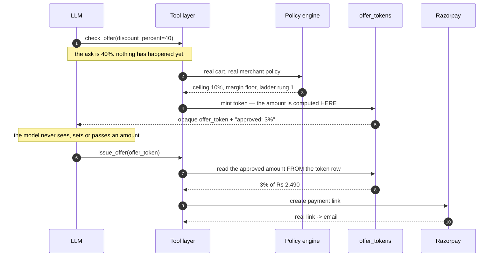
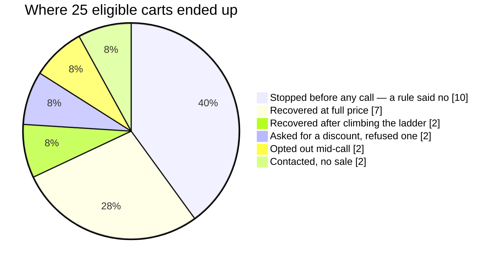
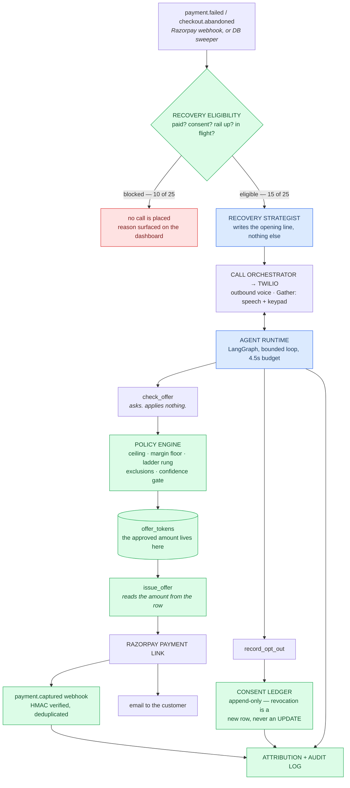

# KINATO


**A payment fails. Kinato phones the customer, finds out why, and — only if a rule engine approves — sends them a real Razorpay payment link.**

That is the whole product. Everything below is about the one hard part: letting a language model run a sales conversation about real money without letting it decide the money.

**▶ [Watch the demo](https://www.youtube.com/watch?v=-OMjnlEXHp8)** — real calls to a real phone, including the one where the agent is asked for 40% off and refuses.

---

## The idea, plainly

Every merchant loses a chunk of revenue to checkouts that got 90% of the way and stopped. A card declined. A bank OTP page timed out. Someone typed in their address and wandered off. The money was on the table and nobody picked it up.

Merchants already know this. What they don't have is anyone to *do* something about it, because doing something means one human phone call per failed cart, in the ten minutes while the customer still remembers the purchase.

So: an AI agent makes the call.

The obvious objection is the correct one. **You cannot hand a language model a discount button.** It will hallucinate 40% off for a customer who asked politely. It will be prompt-injected. It will invent an amount and say it with total confidence. A model that can *say* "here's ₹2,000 off" and have that be true is a model that can cost a merchant real money by being wrong once.

Kinato's answer is structural, not a prompt:

**A tool call from the model is a request, never an effect.**

1. The model calls `check_offer(discount_percent=40)`. This **applies nothing**. It loads the real cart and the merchant's real policy, runs a deterministic engine, and returns an opaque `offer_token` — plus what was *actually* approved, which may be 10%, or nothing.
2. The only tool that can move money is `issue_offer(offer_token=…)`.
3. `issue_offer` reads the amount **from the server-side token row**, never from an argument the model passed.

A hallucinating or injected model can only hand back an opaque string whose amounts were computed by code it never touched. A test asserts at import time that no tool schema accepts `merchant_id`, `amount`, `phone`, or `email` from the model.

The model chooses **what to say**. Code chooses **what money moves**. That line is the product.



The model asked for 40% and the customer got 3%, because the number came from a
row the model cannot write to.

### Does it work?

25 recovery scenarios, run end to end through the real agent, the real policy engine and the real database:

```
Matched expected outcome:  24/25
RULE BREAKS:               0
contacted 15 + stopped 10 = 25 eligible
Recovered:                 Rs 16,196.08  of Rs 49,875 at risk
                           7 full price - 2 discounted - 2 no sale
```

Reproduce with `python scripts/run_recovery_batch.py`. It is stable across runs.

The number that matters is `RULE BREAKS: 0`. To show that isn't luck, `scripts/run_ablation.py` strips the guardrails and re-runs the same 25:

| Arm | Rule breaks | | What broke |
|---|---|---|---|
| **GATED** — what ships | **0** | | — |
| NO_POLICY — model decides discounts | 3 | `███` | approved **60% off** against a 10% ceiling |
| NO_GUARDS — nothing between model and money | 5 | `█████` | the above, plus claims of money that never moved |

Same model, same prompts, same scenarios. The difference is entirely the engine.

Where the 25 carts ended up:



**Ten of twenty-five were never called at all** — 4 without consent, 3 who had
already paid, and one each for quiet hours, a contact cap and no reachable
number. That is the half of the scoreboard most recovery demos leave out, and
it reconciles: `contacted 15 + stopped 10 = 25`, printed by the script rather
than asserted here.

**One thing this number is not.** ₹16,196.08 is gross recovery against a
full-price counterfactual — it is *not* incremental lift over an untreated
control. Measuring that honestly needs a randomised no-contact holdout, and a
holdout run against simulated customers only measures the simulator. We have 8
real `RECOVERED` rows, which is not enough to hold anything out of. What the
ablation above *does* prove is narrower and real: the policy engine is
load-bearing, because the same agent without it gives away 60%.

The ladder is visible in the same numbers. Before it, an over-ask was answered
with the merchant's full ceiling in one step and the batch gave away 20% in
total; opening at the first rung instead, the same nine sales closed for 8% —
₹335 more recovered, and nobody walked.

### What is real, and what is simulated

Stated up front, because it is the first thing worth knowing about any recovery demo.

| | Real | Simulated |
|---|---|---|
| The agent, LangGraph loop and prompts | ✅ | |
| Policy engine, offer tokens, margin floor, ladder | ✅ | |
| Database, audit log, consent ledger | ✅ Postgres | |
| **Outbound phone calls** | ✅ Twilio — a real phone rings | |
| **Speech-to-text and TTS** | ✅ Twilio `<Gather>` | |
| **Email delivery** | ✅ Resend | |
| Razorpay payment links — **on a live call** | ✅ real test-mode API | |
| Razorpay payment links — **in the 25-cart batch** | | 🔸 final mint stubbed |
| The customer in the 25-cart batch | | 🔸 scripted speech |

Two of those need saying plainly rather than being left in a table.

**The batch stubs the last API call only.** Razorpay's test mode caps you at 30
payment links *cumulatively*, which a single 25-case run exhausts — so the
policy decision, the margin floor, the offer-token gate and every audit row are
real, and only the final link-minting call is stubbed. Live calls mint genuine
links.

**The batch's customer is scripted.** The agent, engine, tokens, database and
audit trail on that run are all real; the person on the other end is not. Live
calls are real on both ends, but there have been a handful of them, not
twenty-five. Both things are true at once, and neither on its own is the whole
picture — which is why both are here.

---

## Run it locally

**Needs:** Python 3.11+ and Node 18+. Nothing else is mandatory — the app boots with an empty `.env` and falls back to local SQLite.

### 1. Backend

```bash
cd backend && pip install -r requirements.txt && cp .env.example .env && python run_backend.py
```

Serves on `http://127.0.0.1:8000`, docs at `/docs`.

`.env.example` is commented key by key. The short version of what each key buys you:

| Left empty | What you lose |
|---|---|
| `OPENROUTER_API_KEY` | the agent's reasoning — it runs *degraded*, and a degraded agent is structurally forbidden from calling any mutating tool |
| `RAZORPAY_*` | real payment links |
| `TWILIO_*` | outbound calls |
| `RESEND_API_KEY` | offer email |
| `DATABASE_URL` | Postgres — falls back to a local SQLite file |
| `GOOGLE_CLIENT_ID` / `GOOGLE_CLIENT_SECRET` | "Continue with Google" — the button hides itself rather than failing |

### 2. Frontend

```bash
cd frontend && npm install && npm run dev
```

Open `http://localhost:3000`. Set `NEXT_PUBLIC_API_URL=http://127.0.0.1:8000` in `frontend/.env.local`.

### 3. See it work without any credentials at all

```bash
cd backend && python scripts/run_recovery_batch.py
```

25 recovery scenarios against simulated customer speech — but a **real** agent, policy engine, offer-token gate, database and audit trail. This is the fastest honest look at the system, and where the scoreboard above comes from.

```bash
cd backend && python -m pytest tests/ -q
```

802 tests, run against a real database — no mocked repositories. Test doubles appear only where a test must not place a real phone call or spend real money.

### 4. Take a real call (optional)

Twilio has to reach your laptop, so you need a public URL:

```bash
ngrok http 8000
```

Put the `https` URL in `NGROK_URL` in `backend/.env`, fill in `TWILIO_ACCOUNT_SID`, `TWILIO_AUTH_TOKEN` and `TWILIO_PHONE_NUMBER`, then trigger a recovery from the dashboard.

---

## Third-party services

Eight, and six of them are optional to run.

| Service | Used for | Needed locally? |
|---|---|---|
| **Razorpay** | payment links, `payment.failed` / `payment.captured` webhooks, HMAC verification | only for real links |
| **Twilio** | outbound voice — `<Gather>` turn-taking, built-in speech-to-text, and TTS (`Google.en-IN-Neural2-B`) | only for real calls |
| **OpenRouter** | the LLM. Default `openai/gpt-4o-mini` — one key, model is a config line | yes, for a non-degraded agent |
| **Resend** | offer and reminder email | only for real email |
| **Supabase (Postgres)** | the database | no — SQLite fallback |
| **Railway** | backend hosting | no |
| **Vercel** | frontend hosting | no |
| **Google OAuth** | optional "Continue with Google" sign-in | no — the button only appears when the server is configured for it |

Notably **not** used: no separate speech vendor, no vector database, no orchestration SaaS. Speech-to-text is Twilio's own `Gather` transcription. The agent loop is **LangGraph**, running in-process.

---

## Production limitations

The honest list — what would stop this serving a real merchant tomorrow.

**Twilio is on a trial account.** It can only call **numbers verified in the Twilio console**, and every call opens with Twilio's own trial announcement. Add your number to the verified list and it will genuinely ring you — but out of the box it will not call an arbitrary customer. Lifting that is a paid Twilio upgrade, not a code change.

**Razorpay is in test mode.** Test mode caps you at **30 payment links**. We hit that ceiling twice during development, which is why the agent now reuses an existing unexpired link for the same cart at the same amount instead of minting a new one every time.

**A voice turn gets about 5 seconds, not 15.** Twilio documents a 15-second webhook timeout; on this deployment the real budget measured closer to 5, after which Twilio plays an error and drops the call mid-sentence. The entire turn lives inside that — speech-to-text, a policy lookup, one or two LLM round trips, TTS. `TURN_HARD_TIMEOUT_S = 4.5` is set from measurement, not from the documentation, and the agent shortens its reply rather than losing the call.

**Speech recognition is the weakest link.** `<Gather>` takes exactly **one** language; there is no bilingual recogniser. We use `en-IN`, which handles code-switched Hinglish better than `hi-IN` handles English. Accents and line noise still degrade it, and STT fails *silently* — it returns a fluent sentence nobody said. So money tools are blocked below a Twilio confidence of 0.6, and the keypad, which transcription cannot corrupt, always works: **9 opts out immediately**, with no model involved.

**Single process.** In-flight conversation state and the policy cache are per-process. More than one worker needs both moved to shared storage first.

**Webhook setup is per-merchant and manual.** Each merchant pastes their own URL and signing secret into their Razorpay dashboard. There is no OAuth-style one-click connect.

**The batch scoreboard uses simulated customer speech.** The agent, policy engine, tokens, database and audit trail in that run are all real; the person on the other end is not. Live calls are real end to end, but they are a sample of a few, not 25.

**Not built:** WhatsApp. Automatic card retries — they need stored mandates, which is a separate Razorpay product surface. Multi-tenant AI-buyer commerce: `create_purchase_intent` returns `REJECTED: catalog_not_yet_multi_tenant` rather than guessing a merchant, and the dashboard marks it "soon" instead of faking it.

---

## Architecture

AI reasoning is separated from deterministic services.

Green is deterministic code. Blue is the language model. **Nothing blue touches
money.**

<p align="center">
  
</p>

<details>
<summary>Diagram source (Mermaid) — <code>docs/diagrams/architecture.mmd</code></summary>



</details>

Read it as two languages that meet at exactly one place. The blue boxes decide
**what to say**. Everything green decides **what happens**. `check_offer` is the
seam, and it hands back a token rather than a decision.

Every tool call — arguments, decision, latency, and whether it ran degraded — is written to `audit_log` and readable in the dashboard's recovery drawer.

---

## Stopping rules

The agent is judged on when it *doesn't* call as much as on when it does.

- **Consent revoked** → a new append-only row, checked before every outreach. Revocation is never an UPDATE.
- **Razorpay rail down** → `payment.downtime.started` sets a durable flag. Nobody is called about a failure that may be Razorpay's outage rather than their card.
- **No contact details** → recovery blocked, and the reason surfaced on the dashboard rather than silently dropped.
- **Degraded agent** → an agent running without its LLM cannot call any mutating tool at all.
- **Duplicate webhooks** → deduplicated against a database UNIQUE constraint, so a redeploy landing between Razorpay's retries cannot double-count revenue.
- **A discount is climbed to, not jumped to** → the agent opens at the first rung of the merchant's own offer ladder (default 3%), and only reaches the ceiling if the customer turns down the steps below it. The rung is counted from offers already quoted, so it cannot drift from what was actually said. Measured on the batch: same nine recoveries, discount given away cut from 20% to 8%, ₹335 more recovered — nobody walked.
- **The sale comes first** → a customer ready to buy gets a full-price link. The agent never volunteers a discount, and a declined card is treated as a broken checkout — not a price objection, and not a scheduling one either. Both routes are refused with the same `REJECTED_FULL_PRICE_FIRST` code from the deterministic failure classifier, not by a prompt.
- **"Not till payday" is a clock problem, not a price problem** → the one objection money off does not solve. A deterministic planner picks 2–3 follow-up moments from the decline type and the calendar, clamped inside the merchant's own calling hours, and hands the agent a finished phrase to read. It suggests; it never schedules. A date holds only once the customer agrees to it, through the same promise-to-pay path as everything else — and a hard decline is offered no date at all, because waiting will not make that card work.
- **We might have misheard** → below 0.6 confidence no money tool runs; below 0.3 the model isn't called at all and the agent asks them to repeat it.
- **The keypad always works** → every prompt accepts speech or a digit, and a pressed key beats whatever noise was transcribed alongside it. It is the one input path transcription cannot corrupt, which is why opt-out lives there.
- **A promise is remembered, and chased once** → "I'll pay Friday" pauses outreach until Friday. If it lapses, exactly one reminder — and only if they haven't paid, haven't opted out on any channel, and there is a real link to remind them of.
- **The agent never asks for card details** → a guard rewrites the reply if it starts to.

---

## Integration

**Zero code (recommended).** One webhook URL in the Razorpay dashboard:

```
https://<your-kinato-host>/webhooks/razorpay/<merchant_id>
```

Enable `payment.failed` and `payment.captured`. `payment.failed` is the primary trigger — it carries the customer's real email and phone, so recovery starts in seconds, with no timer and nothing on the storefront.

**With the SDK** (adds abandoned-cart coverage). One tag, and no other code:

```html
<script src="https://<your-kinato-host>/sdk/kinato.js" data-key="pk_test_..."></script>
```

If the page uses Razorpay Checkout, that is the entire integration. The SDK wraps
`new Razorpay(options)` and reads the amount, currency, order id and prefilled
contact details that are already in it — so there is nothing to add to your
checkout code. It never fabricates consent: an auto-captured customer has none,
and outreach stays blocked until a real permission exists. Auto-capture gets us
the cart; it does not get us the right to call about it. Opt out with
`data-auto="off"`.

Three methods remain for anything the wrapper cannot see: `Kinato.init`,
`Kinato.identify`, `Kinato.track`.

**Your catalogue.** Upload the CSV you already have. Column names do not need to
match anything — `SKU Code`, `Product Title`, `Selling Price`, `Cost Price` are
all understood, a title row or blank line above the table is skipped, and prices
written `₹1,299.00`, `Rs. 540` or `899/-` all parse. It shows you the columns it
matched and the rows it read *before* saving, and names every row it is skipping
and why.

Worth doing rather than skipping: cost price is one of the two inputs to the
margin floor. Without it the ceiling is the only thing standing between the
agent and your margin, and the upload says so rather than leaving you to notice.
Which column is your cost is also the one mapping worth checking by eye — get it
wrong and you change which discounts are legal on every future call, which is
why the step exists at all instead of a one-click import.

---

## Documentation

- **[`FINDINGS.md`](FINDINGS.md)** — what broke, and what we did about it. Real failures hit against a live storefront and a real phone, each with its fix and its regression test. **Start here if you read only one.**
- **[`docs/JUDGE-DEMO.md`](docs/JUDGE-DEMO.md)** — verification guide, real-vs-simulated table, known weaknesses.
- **[`DISCLOSURE.md`](DISCLOSURE.md)** — trade-offs, the security boundary, and an explicit list of what is *not* built.
